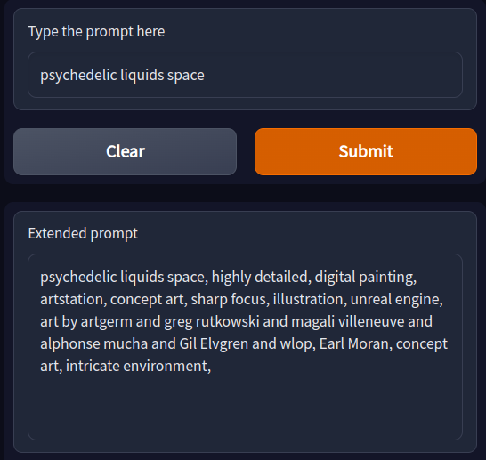
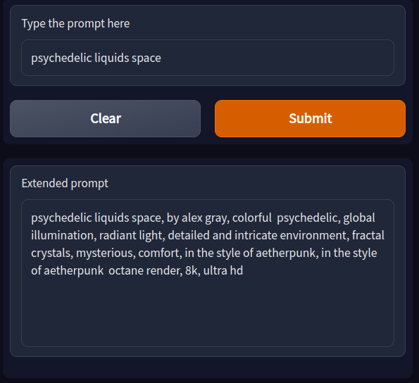
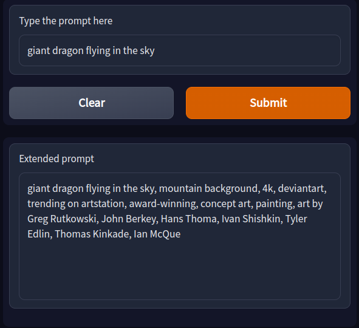
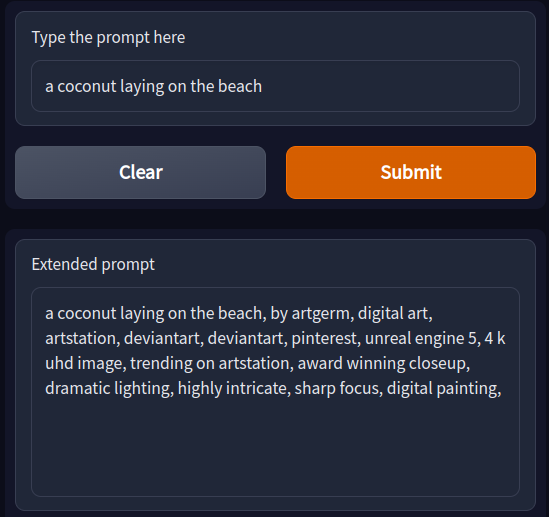
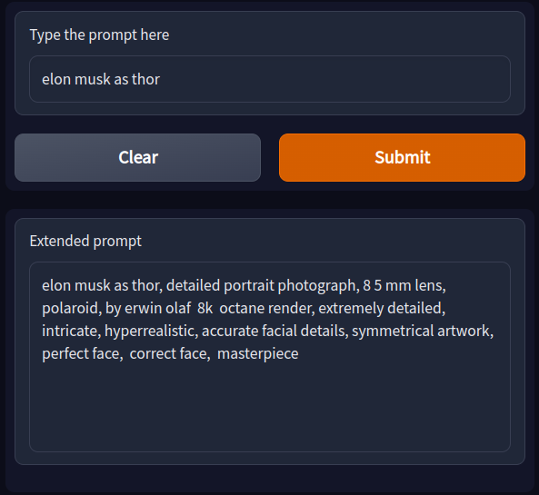

# Prompt Extend

Extending stable diffusion prompts with suitable style cues using text generation.

Play with it on [HuggingFace Space](https://huggingface.co/spaces/daspartho/prompt-extend). 

[Tokenizer](https://huggingface.co/daspartho/prompt-tokenizer) and [Model](https://huggingface.co/daspartho/prompt-extend) on HuggingFace Hub.

# Code
- [dataset.ipynb](https://github.com/daspartho/prompt-extend/blob/main/dataset.ipynb): Creating a [subset dataset](https://huggingface.co/datasets/daspartho/stable-diffusion-prompts) of [diffusiondb](https://huggingface.co/datasets/poloclub/diffusiondb) consisting of just unique prompts.
- [tokenizer.ipynb](https://github.com/daspartho/prompt-extend/blob/main/tokenizer.ipynb): Training a new tokenizer on the [dataset](https://huggingface.co/datasets/daspartho/stable-diffusion-prompts) of stable diffusion prompts.
- [model.ipynb](https://github.com/daspartho/prompt-extend/blob/main/model.ipynb): Training a GPT-2 model on the [dataset](https://huggingface.co/datasets/Gustavosta/Stable-Diffusion-Prompts) of stable diffusion prompts using the [trained tokenizer](https://huggingface.co/daspartho/prompt-tokenizer).
- [inference.ipynb](https://github.com/daspartho/prompt-extend/blob/main/inference.ipynb): Trying the prompts generated using the [trained model](https://huggingface.co/daspartho/prompt-extend) with stable diffusion.
- [app.ipynb](https://github.com/daspartho/prompt-extend/blob/main/app.ipynb): Gradio app for the model.

# Examples

# Contributing
If you want to contribute code, simply create a pull request. If you have an idea, create an issue and the developers will look into it!
